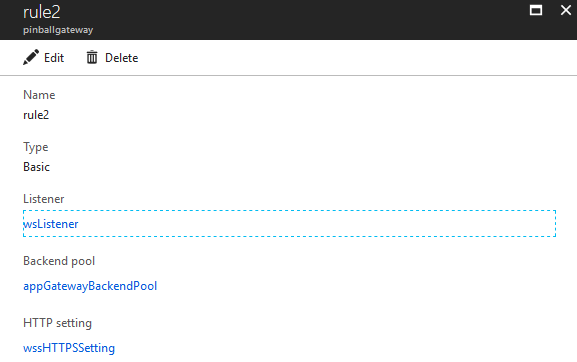

Pinball Lizard:  
step-by-step game deployment

Mixed reality \| Azure gaming

Copyright

Information in this document, including URL and other Internet website
references, is subject to change without notice. Unless otherwise noted,
the companies, organizations, products, domain names, email addresses,
logos, people, places, and events depicted in examples herein are
fictitious. No association with any real company, organization, product,
domain name, email address, logo, person, place, or event is intended or
should be inferred. Complying with all applicable copyright laws is the
responsibility of the user. Without limiting the rights under copyright,
no part of this document may be reproduced, stored in or introduced into
a retrieval system, or transmitted in any form or by any means
(electronic, mechanical, photocopying, recording, or otherwise), or for
any purpose, without the express written permission of Microsoft
Corporation.

Microsoft may have patents, patent applications, trademarks, copyrights,
or other intellectual property rights covering subject matter in this
document. Except as expressly provided in any written license agreement
from Microsoft, the furnishing of this document does not give you any
license to these patents, trademarks, copyrights, or other intellectual
property.

[© 2018 Microsoft Corporation. All rights
reserved.](https://www.microsoft.com/info/cpyright.mspx)

Microsoft, Azure, HoloLens, Visual Studio, and Windows are either
registered trademarks or trademarks of the Microsoft group of companies.

All other trademarks are property of their respective owners.

Contents [contents]
========

[Introduction](#introduction)

[Architecture diagram](#architecture-diagram)

[Important links](#important-links)

[Requirements](#requirements)

[Assumptions](#assumptions)

[Setup Azure Functions](#setup-azure-functions)

[Prerequisites](#prerequisites)

[Install .NET Core 2.X for Windows](#verify-.net-4.7.1-for-windows-is-installed)

[Install Node.js](#install-visual-c-redistributable-packages-for-visual-studio-2013)

[Install Git for Windows and download Pinball Lizard repo](#install-git-for-windows-and-download-pinball-lizard-repo)

[Install Azure Functions Core tools package](#install-azure-functions-core-tools-package)

[Install VSCode and the Azure Functions extension](#install-vscode-and-the-azure-functions-extension)

[Load and configure Azure Functions locally](#load-and-configure-azure-functions-locally)

[Configuration function](#bindings-and-triggers)

[Setup Cosmos DB](#setup-cosmos-db)

[Prerequisites](#prerequisites-1)

[Create the Cosmos DB resource](#create-the-cosmos-db-resource)

[Record the connection string](#record-the-connection-string)

[Azure Storage Account](#azure-storage-account)

[Azure Application Gateway](#azure-application-gateway)

[Endpoints](#azure-app-service-plan)

[Router](#section-3)

[Config](#section-4)

[Auth Tokens](#auth-tokens)

[PlayFab](#playfab)

[Mixer](#mixer)

[Bindings and triggers](#bindings-and-triggers)

[Publish Azure Functions](#create-local-git-repo)

[Verify deployment](#verify-deployment)

[Setup Containers](#setup-containers)

[Azure container instances](#azure-container-instances)

[Configure and deploy container groups](#install-docker)

[Verify deployment](#_Toc519166873)

[Unity 3D](#record-the-container-group-ip)

[Download and install correct version of Unity editor](#install-windows-sdk)

[Download source code from GitHub repository](#section-6)

[Open Pinball Lizard Unity project](#open-pinball-lizard-unity-project)

[Activate Best HTTP (Pro)](#activate-best-http-pro)

[Configure Unity game engine to connect to Azure Functions](#configure-unity-game-engine-to-connect-to-azure-functions)

[Build Pinball Lizard for mixed reality](#build-pinball-lizard-for-mixed-reality)

[Choose mixed reality tools](#test-and-run-pinball-lizard-in-unity)

[Samsung Odyssey](#samsung-odyssey)

[HoloToolkit](#holotoolkit)

[Build UWP application using Visual Studio](#build-uwp-application-using-visual-studio)

[Appendix](#learn-more-about-azure-gaming)

[Install Postman](#install-postman)

[Install Windows Subsystem for Linux](#install-windows-subsystem-for-linux)

[Install Node.js on Ubuntu](#install-node.js-on-ubuntu)

[Install Git and clone the Pinball Lizard repo on Ubuntu](#install-git-and-clone-the-pinball-lizard-repo-on-ubuntu)

[Run Node.js applications](#_Toc519166890)

[SSL Certs](#ssl-certs)

[Learn more about Azure gaming](#learn-more-about-azure-gaming)

[Run Docker containers locally](#install-docker)

[Config files](#ssl-certs)

Introduction
============

Architecture diagram
--------------------

Important links
---------------

Source code repo:
<https://github.com/Azure/gaming/tree/master/pinball-lizard>

Pinball Lizard Booklet:
<https://github.com/Azure/gaming/blob/master/pinball-lizard/manual/Game_Booklet_FINAL_Digital_3-15-2018.pdf>

Requirements
------------

This guide will walk you through installing most of the requirements
below.

-   Windows SDK 10.0.16299

-   Visual Studio Code 1.25.1

-   Git for Windows

-   Azure Account

-   Azure Functions Core Tools v1

-   Azure Function Extension (VS Code)

-   Node.js 10.x +

-   WSL

-   Ubuntu

-   Fall Creators Update

-   Developer mode is enabled

-   Latest graphics drivers from the GPU manufacturer

-   Unity (Windows Mixed Reality Technical Preview U4)

-   Best Http (Unity Asset Store)

-   Visual Studio 2017

Assumptions
-----------

To complete this step-by-step guide, prior knowledge of the following
topics is recommended:

-   Unity

-   Visual Studio and C\#

-   Azure Portal

-   -   Node.js

-   Git

-   Mixed Reality (HoloToolkit)

-   Cosmos DB

-   Docker

Setup Azure Functions
=====================

Prerequisites
-------------

The Azure Functions emulator can be installed locally on multiple
operating systems, allowing you to develop Azure Functions in your own
development environment.

In this guide we will be walking through how to install Azure Functions
Core Tools version 2.x on Windows. To learn more visit
<https://docs.microsoft.com/en-us/azure/azure-functions/functions-run-local>

### Verify .NET 4.7.1 for Windows is installed

If you are unsure how to verify .NET Framework versions, follow this
link.

Download and install .NET 4.7.1 for Windows using this
[link](https://www.microsoft.com/net/download/windows).

### Install Visual C++ Redistributable Packages for Visual Studio 2013

Install the above package here.

**\*\*\*Note**: Make sure to install x86

### Install Node.js

Download and install the Node.js msi installer under **Current Latest
Features** using this [link](https://nodejs.org/en/download/).

**\*\*\*Note**: Make sure to install version 10.x or later.

### Install Git for Windows and download Pinball Lizard repo

Download and install Git using this
[link](https://git-scm.com/downloads). Open PowerShell and clone the
Pinball Lizard repo by running the following command:

**\*\*\*Note**: **Set-ExecutionPolicy RemoteSigned** might be required

**git clone https://github.com/Azure/gaming.git**

### Install Azure Functions Core tools package

Open PowerShell and navigate to the working directory then run the
following command**:**

**npm install -g azure-functions-core-tools**

### Install VSCode and the Azure Functions extension

Download and install VSCode using this
[link](https://code.visualstudio.com/). Search for and download the
**Azure Functions** extension**.**

Once the extension is installed, click **reload** and log into your
Azure account - in the Actvity Bar, click on the Azure logo to show the
**Azure Functions** explorer. Click **Sign in to Azure...** and follow
the instructions.

Load and configure Azure Functions locally
------------------------------------------

Now that you have the core utilities installed for Azure Functions, it’s
time to launch them. Open PowerShell and then navigate to the
**web-functions** subdirectory in the Pinball Lizard source code you
downloaded:

**cd \<source\_dir\>\\gaming\\pinball-lizard\\web-functions**.

Start the Azure Functions host with the following command.

**func host start --useHttps**

Press **CTRL+C** to terminate job

We will now implement the same logic inside VS Code to ensure that all
testing is consistent. In VS Code, open the **tasks.json** file and edit
the **command** value to match the same command we used earlier.

"command": "func host start",

change to

"command": " func host start --useHttps ",

> "command": "func host start",
>
> change to
>
> "command": " func host start --useHttps ",

Press **F5** to launch the Functions Host.

> **\*\*\*Note**: VSCode has known issues with attaching a debugger when
> using Azure Functions Core tools. You can safely either ignore the
> message below or disable the debugger.
>
> 

Press **CTRL+C** to terminate job

### Bindings and triggers

Azure Functions uses different methods—bindings and triggers—to access
the data it needs. Bindings are input and output pipelines that can
access a multitude of data types. Triggers are similar to “calling” the
function, and a single payload is required for the trigger to function.

Although there are many types of bindings that can be used, Pinball
Lizard used Cosmos DB.

Learn more about [Azure Functions triggers and
bindings](https://docs.microsoft.com/en-us/azure/azure-functions/functions-triggers-bindings).

### Configuration function

**\*\*\*NOTE:** The configuration function is the most critical piece of
Pinball Lizard. Everything else will fail if this is not in place and
functional, either locally or in Azure, before you attempt to start.

All configurations are applied through the Azure portal via Azure
Functions application settings, or through the local Azure Functions
settings (\<pinball lizard root\>\\web-functions\\local.settings.json).

This function will return all of the configuration parameters required
for the Node.js applications. A short description has been included
about each configuration.

This guide will walk you through each of these settings step by step so
you do not have to worry about filling in the values now. The links will
point to where in the guide you can find instructions for that paticular
value. Values that do not have links will either accept the default
value listed.

-   APP\_GATEWAY\_IP: \[IP ADDRESS\]

    -   IP address of Azure application gateway

-   SSL\_PASSPHRASE: \[STRING\]

    -   Passphrase for SSL cert being used for certs that were generated

-   CONFIG\_ENDPOINT\_URL: \[URL\]

    -   Base URL for Azure Functions endpoint (local or Azure)

-   CONFIG\_ENDPOINT\_KEY: \[HOST KEY\]

    -   Hashed key that the client is required to send before it will
        receive any data

    -   Key that must also be configured through Function App Settings
        in the Azure Functions blade (via the Azure portal, under the
        Host Keys (All functions) section)

-   COMMANDER\_IP: \[IP ADDRESS\]

    -   IP address given to commander container

-   COMMANDER\_PORT: \[INT\]

    -   Default: 9221

-   COMMANDER\_TOKEN: \[STATIC KEY\]

-   COMMANDER\_NUMBER\_OF\_FORMATIONS: \[INT\]

    -   Default: 12

    -   Max number of formations that commander will keep at once

-   COMMANDER\_FORMATION\_SIZE: \[INT\]

    -   Default: 6

    -   Max number of Ice Lice per formation

-   INTERNAL\_RELAY\_IP: \[IP ADDRESS\]

    -   IP address given to internal relay container

-   INTERNAL\_RELAY\_PORT: \[INT\]

    -   Default: 9125

-   INTERNAL\_RELAY\_AUTH\_TOKEN: \[STATIC KEY\]

-   INTERNAL\_RELAY\_ALLOWED\_HOSTS: \[CSV STRING}

    -   List of URLs that are allowed to communicate with internal relay
        (comma separated)

-   ROUTER\_IP: \[IP ADDRESS\]

    -   IP address given to router container

-   ROUTER\_PORT: \[INT\]

    -   Default: 9010

-   ROUTER\_WS\_PORT: \[INT\]

    -   Default: 8085

-   ROUTER\_AUTH\_TOKEN: \[STATIC KEY\]

-   MIXER\_HANDLER\_TOKEN: \[STATIC KEY\]

-   MIXER\_HANDLER\_IP: \[IP ADDRESS\]

    -   IP address given to Mixer container

-   MIXER\_HANDLER\_PORT: \[INT\]

    -   Default: 9110

-   MIXER\_CHANNEL\_TOKEN: \[STATIC KEY\]

    -   Key obtained from Mixer website on a per-channel basis

-   MIXER\_CHANNEL\_VERSION\_ID: \[INT\]

    -   Version of Mixer channel being used

-   MIXER\_BUTTON\_COOLDOWN: \[INT\]

    -   Default: 5000

    -   How long button cooldown for interaction should be

-   PLAYFAB\_HANDLER\_IP: \[IP ADDRESS\]

    -   IP address given to PlayFab container

-   PLAYFAB\_HANDLER\_PORT: \[INT\]

    -   Default: 9111

-   PLAYFAB\_HANDLER\_TOKEN: \[STATIC KEY}

-   PLAYFAB\_API\_TITLE\_ID: \[STATIC KEY\]

    -   Title obtained from PlayFab website

-   PLAYFAB\_API\_SECRET: \[STATIC KEY\]

    -   Key obtained from PlayFab website

-   ROUTER\_FUNCTION\_ENDPOINT: \[URL\]

    -   Endpoint URL for router function located at \<base URL\>\\api

-   ROUTER\_FUNCTION\_KEY: \[STATIC KEY\]

    -   Host key found in Function app settings part of Azure Functions

When the configuration is changed, **config/reload** is called, and the
app config will be reloaded in memory.

### Create a default function

The Function App in Azure requires a default response in order to
prevent it from automatically shutting down. We will be creating a
simple http trigger function that returns an “ok” response.

Open up the **web-functions** folder in VS Code and create a new
function **folder** called **default.**

Within the default folder, first create a **function.json** file with
the following contents. (Copy and paste)

{

"disabled": false,

"bindings": \[

{

"authLevel": "function",

"type": "httpTrigger",

"direction": "in",

"name": "req",

"methods": \[

"get"

\]

},

{

"type": "http",

"direction": "out",

"name": "res"

}

\]

}

Then create an **index.js** file with the following contents within same
default function folder.

'use strict'

/\*

\*

\* Returns a default response. This is required to prevent the Function
App from auto closing

\*

\*/

module.exports = function (context, req) {

context.res = {

body: 'ok'

};

context.done();

}

Press **CTRL+K, S** to save all changes.

### 

-   -   

-   -   

-   -   

-   -   -   

-   -   

-   -   

-   -   -   -   

-   -   -   

-   -   

-   -   

-   -   -   

-   -   

-   -   

-   -   

-   -   -   -   

-   -   

-   -   

-   -   

-   -   -   

-   -   

-   -   

-   -   -   

-   -   

-   -   

-   -   

Setup Cosmos DB
---------------

### Prerequisites

If you do not already have an Azure subscription, you can create one for
free at the following link: https://aka.ms/azft-gaming

### Create the Cosmos DB resource

From your Azure dashboard click the **+** icon in the top left corner
and search the market pace for **Azure Cosmos DB** and click **Create.**

Name your Cosmos Db instance and select the **SQL** api. If you do not
have an existing resource group, create a new one. Choose your location
and click **Create** when finished.

**\*\*\*Note:** Naming will be unique to your environment

Once you hit save and the Cosmos DB instance is deployed you will land
at the Quick Start page. On the left navigate to **Collections -\>
Browse -\> + Add Database** and create a database called **VR-Game.**

### 

### Record the connection string

Once you have created the Cosmos DB resource, you will need to record
the connection string under the left side navigation to **SETTINGS -\>
Keys -\> PRIMARY CONNECTION STRING** and input the string into the
following two places: **Azure Functions App** setting (applied in later
steps) and the **local.settings.json** file in the web-functions folder.

AzureWebJobsDocumentDBConnectionString

Azure Storage Account
---------------------

Create an Azure storage account by clicking **+ Create a resource -\>
Storage -\> Storage account**

Name the storage account and select the **Location** and **Resource**
**Group** used in previous steps.

Once you have created the storage account, open the newly created
account and navigate to **SETTINGS -\> Access Keys** and record the
**connection string** for the following Azure Functions app setting**.**

-   AzureWebJobsStorage: \*\*\*
    DefaultEndpointsProtocol=https;AccountName=\[name\];AccountKey=\[key\]\*\*\*

Azure Application Gateway
-------------------------

Azure Application Gateway is a web traffic load balancer that enables
you to manage traffic to your web applications.

### Create the Gateway

Login to the Azure portal and click **+ Create a resource** found on the
upper left-hand corner of the Azure portal. Select **Networking** and
then select **Application Gateway. **

Enter a name for your gateway and select the resource group you created
in previous steps. Make sure to choose the same **Location** used when
creating your resource group and Cosmos DB resource. Select an
**Instance count** of **2. **

Create a new **virtual network** and **public IP**

Configure listener to use **HTTP** then **Review** and **Create**.

Once the Application Gateway has been completely deployed, record the
**Frontend public IP address** (**gateway IP)** and update the following
value in the **Azure Configuration Function**.

-   APP\_GATEWAY\_IP: \[IP ADDRESS\]

Azure App Service Plan
----------------------

In order to help allocate resources we will be creating an App Service
plan in the Azure Portal.

Click **+ Create a resource** from left top navigation and then search
for or select **App Service Plan**

Change the OS type to **Windows** and the location to the **same region
as your storage account** and choose your existing resource group.

Azure Function App
------------------

We will be creating the Function App in the portal and configuring a git
CI

Click **+Create a resourse** **-\> Compute -\> Function App **

Select **Windows OS** and **App Service** then select the App Service
Plan you created in the previous steps**.** Use your **existing resource
group.**

### Application Settings

Open up the newly created Function App and navigate to **Overview -\>
Application Settings -\> General settings**. Turn off PHP support and
FTP access as it’s not needed and change platform to **64-bit**.

Under Application Settings click **+ Add new** **setting** and add the
application settings found in your
**web-functions\\local.settings.json** file. Click **Save** at the top
when done.

\*\*\*NOTE: The example screenshot does not contain all of the necessary
settings.

#### Endpoint URIs

We will need to update the Endpoint URIs to point to the Azure Function
App. Find the function app URL under **\<your\_fucntion\_app\> -\>
Overview URL.** It will be in the format of
https://\<your\_function\_app\>.azurewebsites.net

Replace localhost:7071 with the above URL for both of the following
values in your Applciation Settings and local.settings.json.

**Note:** CONFIG\_ENDPOINT\_URI end with \<URL\>/api.config, and
ROUTER\_FUNCITON\_ENDPOINT end with \<URL\>/api as shown in the example
below:-

CONFIG\_ENDPOINT\_URI

ROUTER\_FUNCITON\_ENDPOINT

### Authorization Keys

HTTP triggers let you use keys for added security. A standard HTTP
trigger can use these as an API key, requiring the key to be present on
the request. Webhooks can use keys to authorize requests in a variety of
ways, depending on what the provider supports.

Host Keys are shared by all functions within the function app allow
access to any function within the function app. We will be generating
Host Keys for the Router Function and Config Endpoint.

Open the Function App and navigate to **Platform Features -\> Function
app settings -\> Host Keys -\> Add a new host key.** Name the host key
but leave the value **blank** to generate a random key value**. **

##### Router

Name the Router Function key as follows:

ROUTER\_FUNCTION\_KEY

Update the corresponding value in both the apps settings of the Function
App and within your local.settings.json file with the generated key.

##### Config 

Name the Router Function key as follows:

CONFIG\_ENDPOINT\_KEY

Update the corresponding value in both the apps settings of the Function
App and within your local.settings.json file with the generated key.

### Code deployment using Git

Open up the Function App and navigate to **Platform features -\> CODE
DEPLOYMENT -\> Deployment options.** This action will open right tabs.
Then select **Setup** under **Deployments** tab. Then **Choose Source**
and select either **Git or Github.** The following examples will use a
local Git repository**.**

Create a deployment users and password and click **OK** when done.

Once you have chosen the source navigate to **General Settings -\>
Properties **

Record/save the **GIT URL** in properties for later use.

**\*\*\*Note**: If using a local Git Repo, you can change the deployment
credentials by navigating to **CODE DEPLOYMENT -\> Deployment
credentials**

### 

### 

Auth Tokens 
------------

We need to generate a random UUID for authentication between containers.
Use this [online UUID generator](https://www.uuidgenerator.net/) or one
of your choosing. Once you have generated the Auth Tokens, insert them
in your Function App Settings and in local.settings.json file for the
following values.

"ROUTER\_AUTH\_TOKEN":

"MIXER\_HANDLER\_TOKEN"

"INTERNAL\_RELAY\_AUTH\_TOKEN":

"PLAYFAB\_HANDLER\_TOKEN"

"COMMANDER\_TOKEN"

PlayFab 
--------

PlayFab is a game-monitoring service that also offers dashboard views
for ranking and gameplay statistics. We used PlayFab to monitor the
winners at GDC who won prizes for their efforts.

Create a PlayFab account at this
[link](https://developer.playfab.com/en-us/sign-up). For this guide you
can create an account with minimal information.

After creating a PlayFab account, add the information below to the
Application Settings tab of Azure Functions and to local.settings.json
file.

-   PLAYFAB\_API\_TITLE\_ID: \*\*\*PLAYFAB API TITLE\*\*\*

    Found under **Settings -\> API -\> Title ID**

    

    

-   PLAYFAB\_API\_SECRET: \*\*\*PLAYFAB API SECRET\*\*\*

    Found under **Settings-\> Secret Keys**

    

**\*\*\*Note:** The values are required to integrate PlayFab with
Pinball Lizard and must be entered into the application settings of
Azure Functions.

Mixer
-----

Mixer is a streaming service that allows the viewer to interact with the
person playing the game through various methods: Pinball Lizard uses a
single button. We use Mixer in Pinball Lizard by allowing viewers to
deploy a radioactive Ice Lice that the player can eat to gain the
ability to use the breath weapon.

This is also where we use the microphone built into the Odyssey headset.
Players must hold the radioactive Ice Lice near their mouth and make a
chewing noise to eat it. Afterward, if the players make a loud, roaring
noise, it will activate the breath weapon to inflict massive damage.

Create a Mixer Account at this [link](https://mixer.com/).

**\*\*\*Note**: If run into issues in Edge, try a different browser.

Create an OAuth client by navigating to **MORE -\> Developers -\>
Developer Lab**

Click on “LET’S CREATE ONE” button as shown in the figure below:-

Name the client and input **localhost** for the Hosts option. Do not
select **Use Secret Key.**

Copy the Client ID to the following URI, which you can navigate to your
browser:

https://mixer.com/oauth/authorize?redirect\_uri=https:%2F%2Flocalhost%2Foauth-return&response\_type=token&scope=interactive%3Arobot%3Aself&client\_id=

The navigation should show 'page not found', this is ok. Examine the URI
you were directed to, your oauth\_token will be contained in the URI.
Copy the token part from the URL similar as shown below:-

https://localhost/oauth-return\#access\_token=v6G2g73HAkoKEbuEZqpalkNhEZh8cv8SPUVNN9RaZvRWx7jOg1Bfdioavtxjkv7B&token\_type=Bearer&expires\_in=31535528&state=

Here is another screen shot from different URL.

After creating a Mixer account and generating an access token, add the
following information to the Application Settings tab of Azure
Functions:

-   MIXER\_CHANNEL\_TOKEN: \*\*\*MIXER CHANNEL TOKEN\*\*\*

    -   This will be the OAuth token generated in the previous steps

-   MIXER\_CHANNEL\_VERSION\_ID: \*\*\*MIXER CHANNEL VERSION\*\*\*

To obtain a **VERSION ID** first navigate to **Developer lab -\> MIXPLAY
PROJECTS**, and create a new project.

Then navigate to the **Code** tab where you will find the **VERSION ID.
**

**Note:** The values are required to integrate Mixer with Pinball Lizard
and must be entered into the application settings of Azure Functions and
on local.settings.jason file.

Create local Git Repo
---------------------

We wil be creating a separate Git repo for our functions. Open the
terminal in VS Code and navigate to
**\<pinball\_root\>\\pinball-lizard\\web-functions.**

Type the following command to intialize the git repo

git init

Type the following command to stage all files.

git add -A

Type the following command to run your initial commit.

git commit -m ‘initial’

Set the remote url to point to the Azure Functions App using the Git URL
recorded in previous steps and the following command.

git remote add azure \<git\_url\>

Verify by running the following command.

git remote -v

Publish Azure Functions
-----------------------

If you want to use Azure to host serverless functions, you need to
publish Azure Functions. This can be verified by checking the portal for
populated Azure Functions.

In order to publish your locally developed Azure Functions using Git run
the following command from within the **web-functions** folder and enter
the Git credentials you created earlier when prompted.

git push azure master

Once you have successfully published your Azure Functions you can verify
if your deployment was successful in the Azure portal by navigating to
your Function App and expanding Functions.

Learn more about [how to publish Azure
Functions](https://stackoverflow.com/questions/45387036/how-to-publish-azure-function-from-vs-code).

Verify deployment 
------------------

We will be using Postman to verify successful deployment of our
functions.

Install Postman using this link

In order to test the Config function, we will need to add the Router
Function Key, located in your Function App settings, to the header of
the request. Add the following key and value under headers in your GET
request.

x-functions-key \<ROUTER\_FUNCTION\_KEY\>

Create a **GET** request pointing to the **config URL** and click **Send
**

If successful, it should return the Function Configuration with
populated values from your application settings

Let us run another test to see if the initialize function is generating
an instance ID which is a requirement of several other functions. By
looking at the **index.js** for the **initialize function** we can
determine that the function is looking for a player name in the payload
and if one does not exist it will generate one.

In order to test the Initialize function, we will need to add the Router
Function Key to the header of the request and provide a body. Add the
following **key** and **value** under headers in your **POST**.

x-functions-key \<ROUTER\_FUNCTION\_KEY\>

For the body, select **raw** and provide empty brackets, as shown below,
since the function will generate a random player name.

Ensure your URI is pointing to the intitalize function.

e.g. https://\<your\_functtion\_app\_ URI\>/api/intitalize

Click **Send** and you should receive a response providing you with an
instance ID. Your response should look similar to below:

Setup Containers
================

Azure container instances
-------------------------

Container groups allow you to have containers grouped together on one
host, enabling individual services to communicate without the need for
external DNS or authentication.

\*\*\*NOTE: Since we are using container groups we will be assigning
localhost/loopback addressing to individual containers with the
exception of the Internal-Relay container.

### Install Docker

Download and install docker using this
[link](https://docs.docker.com/docker-for-windows/install/).

**\*\*Note**: This will require hardware virtualization to be enabled.
Consult instructions specific to your motherboard if your run into
errors.

### Run Docker containers locally

With Docker, you do not need to install and run each node application by
hand. Docker will assist you by installing the Node.js platform inside
each container.

Each part of the source code is separated into different parts of the
large machine that is Pinball Lizard. The pieces that need to run as
Docker containers with Node.js embedded will contain a Dockerfile at the
root of the directory and are as follows:

-   commander

    -   Provides gameplay functionality for Pinball Lizard. Game engine
        controls in-game Ice Lice formations and movements, and commands
        air strikes and tank barrages.

-   internal-relay

    -   Routes external calls to relay container, which interprets
        internal messages into API calls for other REST endpoints.

    -   Offloads handling of requests to optimize game response time.

-   Mixer

    -   Node application that establishes a connection with the Mixer
        streaming servers and handles the interactivity between viewer
        and streamer.

-   PlayFab

    -   Provides PlayFab reporting functionality for Pinball Lizard.

-   proxy-router

    -   Node application that manages inbound and outbound
        communications across the game.

#### SSL Certs

Each node application has a folder called **SSL** at its root that
contains two certificate files. These must be generated and placed here
prior to launching the node application. We will be using OpenSSL,
Windows Subsystem for Linux, and Ubuntu to generate the certs. If you do
not already have WSL installed, follow these instructions for Windows 10
then download Ubunutu from the Windows Store.

If you already have PowerShell open and WSL installed, you can type bash
to switch prompts. Otherwise, press **Win** **+ R** then type bash to
launch prompt and run the following commands in your pinball-lizzard
direcotry.

Navigate to the **pinball-lizard directory** and run the following
commands to generate a keypair and cert.

openssl req -x509 -newkey rsa:4096 -keyout key.pem -out cert.pem -days
365

Copy the **key.pem** and **cert .pem** files you generated to the **ssl
folder** of each container (commander, inter-relay, mixer, playfab and
proxy-router).

Learn more about [how to create a PEM file from an SSL
certificate](https://stackoverflow.com/questions/991758/how-to-get-pem-file-from-key-and-crt-files).

#### Config files

Each container has a **config.json** file located in the **src\\config**
folder. This file will start off with three entries: SSL\_PASSPHRASE,
CONFIG\_ENDPOINT\_URI, and CONFIG\_ENDPOINT\_KEY. These values are
required to start the node application contained within. Once the app is
started, it will download the extended configuration from the specified
endpoint.

Edit the config file with **SSL passphrase** you used in the previous
step and your **Config Endpoint** values

### Create an Azure Container Registry

Login into the azure portal and click **+Create a resource** **-\>
Containers -\> Container registry **

**Name** the registry and choose your existing **Resource group.**

Once you have created the Container Registry navigate to **Settings -\>
Access Keys** and record the **Login Server**, **Username** and
**Password** for later use.

**\*\*\*NOTE:** You need to click **Enable** under **Admin User** to see
username and password**.** Your values will be unique to your
environment.

### Create container images

Run the following command inside the container folder to create the
container image. Do this for all containers.

docker build -t \<container\_name\> .

Run the following command to see the newly created images.

docker images

Before we move on to tagging the images please run the docker container
to ensure there are no errors before proceeding. Run the following
command to start the container. Repeate for all containers. Press **CTRL
+ C** to exit.

docker run \<container\_name\>

### Tag and push images to registry

We will now tag the images with the loginServer of our container
registry.

docker tag \<image\_name\> \<acrName\>.azurecr.io/\<image\_name\>

Run the following command to verify the newly tagged images.

docker images

 We will now login to the registry and push the images using the
following commands. Install Azure PoweShell modules using this **Error!
Hyperlink reference not valid.**link.

Connect-AzureRMAccount

Before pushing and pulling container images, you must log in to your
registry. Use the following command to first get the admin credentials
for the registry:

$registry = Get-AzureRMContainerRegistry -ResourceGroupName \<RG\_name\>
-name \<ContianerReg\_name\>

$creds = Get-AzureRmContainerRegistryCredential -Registry $registry

Now run Docker login.

$creds.Password \| docker login $registry.LoginServer -u $creds.Username
--password-stdin

Now that you've logged in to the registry, you can push container images
to it.

docker push \<acrName\>.azurecr.io/\<image\_name\>

You should now see **five image repositories** in the **container
registry**.

### Configure and deploy container groups

With the images now in your registry, deploy a container group directly
to Azure Container Instances to see them running in Azure.

Open up VS Code and navigate to the deployments folder in in the Pinball
repo at **C:\\\<install
dir\>\\gaming\\pinball-lizard\\deployments\\multi-container-group-template**
and open the **parameters.json** file.

{

"$schema":
"https://schema.management.azure.com/schemas/2015-01-01/deploymentParameters.json\#",

"contentVersion": "1.0.0.0",

"parameters": {

"groupSuffix": {

"value": "prod"

},

"commanderURI": {

"value": "set-in-parameter-file "

},

"commanderPort": {

"value": "9221"

},

"internalRelayURI": {

"value": "set-in-parameter-file "

},

"relayPort": {

"value": "9125"

},

"routerURI": {

"value": "set-in-parameter-file "

},

"routerWebsocketPort": {

"value": "8085"

},

"routerBackdoorPort": {

"value": "9010"

},

"mixerURI": {

"value": "set-in-parameter-file "

},

"mixerPort": {

"value": "9110"

},

"playfabURI": {

"value": "set-in-parameter-file "

},

"playfabPort": {

"value": "9111"

},

"imageRegistryLoginServer": {

"value": "set-in-parameter-file "

},

"imageUsername": {

"value": "set-in-parameter-file "

},

"imagePassword": {

"value": "set-in-parameter-file "

},

"osType": {

"value": "Linux"

},

"numberCoresContainer": {

"value": "1"

},

"memoryContainer": {

"value": "2"

},

"numberCoresContainerLight": {

"value": ".5"

}

}

}

Input the tagged container images for the following values leaving the
port numbers at their default value:

commanderURI

internalRelayURI

routerURI

mixerURI

playfabURI

We will need the container registry **Login Server URI**, **Username**
and **Password** for the following values:

**\*\*\*Note:** You may have to regenerate a registry key/password until
it does not contain special characters such as ‘\#’ or ‘%’

Once you have entered the required parameters execute the **deploy.ps1**
PowerShell deployment script. You will be prompted for your
**subscription ID**, **resource group name**, and a **deployment name**.

The process can take a few minutes and you can watch the progress in the
azure portal under **\<container\_group\> -\> Containers**

### Verify deployment 

**\*\*\*Note:** If you run into issued maken sure to copy values into
notepad before pasting them into the parameters.json file to strip any
encoding

You will have a successful container group deployment once all
containers are in a running state.

### Record the Container Group IP

Once the Container Group has been fully deployed you need to record the
IP Address at **\<Container\_Group\> -\> Overview -\> IP Address** and
input it into the following **Azure Functions App** setting as well as
in the local.settings.json file located in your local web-functions
folder.

INTERNAL\_RELAY\_IP

App Gateway Backend Settings

SSL backend cert

We need to generate a .pfx bundle and a .cer certificate for backend
authentication on the Application Gateway. Open an elevated PowerShell
session and use the following commands to generate a .pfx bundle.

> **$cert = New-SelfSignedCertificate -Subject localhost -DnsName
> localhost -FriendlyName "Gateway Backend" -KeyUsage DigitalSignature
> -TextExtension @("2.5.29.37={text}1.3.6.1.5.5.7.3.1")**
>
> **Export-PfxCertificate -Cert $cert -FilePath certificate.pfx
> -Password (ConvertTo-SecureString -String \<password\> -Force
> -AsPlainText)**
>
> 

Run the following command in bash to extract the client certificate from
the pfx bundle using the password created in the previous step. While
still in powershell type bash and press enter to launch bash prompt.

openssl pkcs12 -in input.pfx -out mycerts.crt -nokeys -clcerts

Run the following command to convert the client certificate from PEM
format to DER.

openssl x509 -inform pem -in mycerts.crt -outform der -out mycerts.cer

HTTPS Settings

We will be creating HTTPS settings for the web socket and command.
Navigate **to \<App\_Gateway\> -\> Settings -\> HTTP Settings** and
click **+ Add** to create the web socket settings. Choose port **8085,
HTTPS,** and select the **.cer** certificate we generated in the
previous step.

Follow the same steps for command only selecting port **9010**
instead**.**

Listeners

Next we will need to create create two HTTPS listeners for ports 9010
and 443. . Navigate to **\<App\_Gateway\> -\> Settings -\> Listeners -\>
+ Basic.** For the first listener (back door) select **9010** as the
port and upload the **pfx cert** created in previous steps.

For the second listener (web socket) select **443** as the port and the
**pfx cert**.

Rules

We will now create two rules to tie the settings together. First create
a rule called rule1 and select the port 9010 listener created in the
previous step as well as the port 9010 HTTPS setting.

Second create create a rule called rule1 and select the port 8085
listener created in the previous step as well as the port 8085 HTTPS
setting.

Once you have created and applied the rules you should now see the
associated rule listed under your **Listeners** pane.

Backend pool

With the **HTTP Settings**, **Listeners**, and **Rules** in place, we
need to point the Backend pool to a specific IP. Edit the **Backend
pool** and use the **INTERNAL\_RELAY\_IP** recorded in previous steps.

Here is the screen shot after it is done.

Unity
=====

Install Windows SDK
-------------------

Download and install the Windows SDK here.

Turn on developer mode
----------------------

Go to **Start** **-\>** **Settings** **-\>** **Update & Security -\>**
**For Devlopers -\> Use developer features** and select **Devloper
Mode**

Install Visual Studio 2017
--------------------------

Install and download Visual Studio 2017 here.

Ensure the following workloads are installed.

Download and install correct version of Unity editor
----------------------------------------------------

To compile this application, the [mixed-reality version of Unity
(MRTP4)](http://beta.unity3d.com/download/b1565bfe4a0c/UnityDownloadAssistant.exe)
is required, which was used in the development of Pinball Lizard. It’s a
special Unity build with the Mixed Reality Toolkit built in. Install
Unity selecting **Windows Store options** and accepting defaults for
other options in the Wizard. Once installed, sign into unity.

Open Unity.

Once signed in, click **↑ Open** and locate and open the Pinball Lizard
Unity project

Open Pinball Lizard Unity project
---------------------------------

The Unity code can be found under the Unity folder at the root of the
Pinball Lizard source code. It is a copy of the production code that was
showcased at Game Developers Conference (GDC) 2018. Open the project
folder with the Unity editor, and then load **Basic Scene**.

Now you can see all of the game objects and scripts created during the
development of Pinball Lizard. Any modifications here would deviate from
the original game experienced at GDC 2018.

From here, provided you have a mixed reality headset plugged in, you can
press the **Play** button at the top middle of the Unity 3D editor and
interact with the Unity part of the game.

**\*\*\*Note:** At this point in the guide, the game’s backend is not
functional, which means the game will not play as intended. You will
only be able to interact with the tutorial screen.

Activate Best HTTP (Pro)
------------------------

Pinball Lizard uses Best HTTP (Pro) to facilitate the connection between
Unity and Azure. Without this plug-in, the game will be stuck in
tutorial mode. To use this plug-in, a license is required. If you want
to deploy this yourself, you will need to obtain a license key.

Learn more or [download Best
HTTP](https://assetstore.unity.com/packages/tools/network/best-http-10872).
You can also search for and download Best HTTP from within Unity by
searching for it in the Asset Store.

Once you have downloaded the Best HTTP Pro asset, copy it into your
Pinball Lizard Unity project’s **Assets** folder.

Configure Unity game engine to connect to Azure Functions
---------------------------------------------------------

The Unity game engine needs to communicate with the Azure Functions
endpoint and must be aware of it before the game is built into a
Universal Windows Platform (UWP) application. If this is not enabled,
the application will never interact with the enemies.

You can find the file that needs to be modified at the following
location:

*\<pinball lizard
root\>\\unity\\Assets\\Scripts\\WebSocketClientSingleton.cs*

Modify the following values and press **CTRL + s** to save:

-   private const string address =
    "wss://\<INTERNAL\_RELAY\_IP\>:8085/ws"

    -   

-   private string auth = "\<INTERNAL\_RELAY\_AUTH\_TOKEN\>"

**\*\*\*Note**: These values can be found in your Function App Settings.

-   

**\*\*\*** **Note:** The Unity Game Engine needs to be aware of the
Azure Functions endpoint prior to building, either through local Azure
Functions (using 127.0.0.1) or Azure Functions running on Azure.

Build Pinball Lizard for mixed reality
--------------------------------------

In order to install Pinball Lizard in a reliable way, you need to build
the code into a UWP application that is specifically targeted for the
mixed reality headset.

The build settings must be set in Unity as follows:

-   **Platform**: Windows Universal Platform

    -   Target device: Any device

    -   Build type: D3D

-   **SDK**: Latest installed

    -   Build and run on: Local machine

-   **Copy references**: True (check box)

You can optionally enable debugging to see what is happening as the game
is being played.

Learn more about [mixed
reality](https://docs.microsoft.com/en-us/windows/mixed-reality/unity-development-overview).

Test and run Pinball Lizard in Unity
------------------------------------

Press play to start the game. Make sure to keep headset at eye-level
when you press play. Press the spacebar when the cursor is in the game
window within Unity to generate a new instance.

Choose mixed reality tools
--------------------------

### Samsung Odyssey 

Pinball Lizard was developed using the Samsung Odyssey with motion
controllers, although the game will work on other mixed reality
headsets. One caveat is that it does require motion controllers.

### HoloToolkit

Microsoft has merged development of HoloLens into its mixed reality
platform. Note, however, that we used an older version of the
HoloToolkit, specifically the MRTP4 development build. This gave us the
additional functionality we needed to complete this project.

Build UWP application using Visual Studio
-----------------------------------------

With the C\# application code built, you can now use Visual Studio to
create and deploy the UWP application. This installs the Pinball Lizard
application into the mixed reality portal on your dev machine.

In Visual Studio, be sure to change the build configuration (in the top
middle of the screen) to **X64 Release** and then build toward the local
machine.

Learn more about the [UWP application and Visual
Studio](https://docs.microsoft.com/en-us/windows/uwp/packaging/packaging-uwp-apps).

Learn more about Azure gaming
=============================

When you’re planning your game, don’t forget to visit
[azure.com/gaming](https://indigoslate.sharepoint.com/sites/pwa/VR%20Game%20Development%20%20Launch%20%5bAzure%20Gaming%5d/Shared%20Documents/Working/GitHub%20step%20by%20step/azure.com/gaming)
to learn more about how Azure can help. See how easy it is to build,
launch, and scale across any platform with Azure. You can start a free
trial with $200 in credit by visiting
[azure.com/free](https://indigoslate.sharepoint.com/sites/pwa/VR%20Game%20Development%20%20Launch%20%5bAzure%20Gaming%5d/Shared%20Documents/Working/GitHub%20step%20by%20step/azure.com/free).

Appendix
========

Install Postman
---------------

Download and install Postman using this
[link](https://www.getpostman.com/apps).

Install Windows Subsystem for Linux
-----------------------------------

In this guide we will be using the Windows Subsystem for Linux and
Ubuntu. If you do not already have WSL installed, follow [these
instructions](https://docs.microsoft.com/en-us/windows/wsl/install-win10)
for Windows 10.

Install Node.js on Ubuntu
-------------------------

Open PowerShell and type **bash** and press enter then run the following
commands to install Node.js on Ubuntu using WSL.

**curl -sL https://deb.nodesource.com/setup\_10.x \| sudo -E bash -**

**sudo apt-get install -y nodejs**

Verify installation completed successfully by running the following
command

**npm -v**

Install Git and clone the Pinball Lizard repo on Ubuntu
-------------------------------------------------------

Open PowerShell type **bash** and press enter then run the following
commands**:**

**sudo apt-get install git**

**cd \~**

**git clone https://github.com/Azure/gaming.git**

Install Windows SDK
-------------------

Download and install the Windows SDK here.

Develop functions using Azure Functions Runtime Beta 2.X
--------------------------------------------------------

1.  As of 2.0.1-beta.26 a worker runtime setting is required and can be
    set using the following command. Since we are developing JavaScript
    functions we will be using the **node** runtime. This will modify
    the local.settings.json file of the current Azure Functions project.

    **func settings add FUNCTIONS\_WORKER\_RUNTIME node**

    

2.  Auto cert generation is currently unavailable on the .NET core build
    so we will need to run the following commands in PowerShell in order
    to generate the SSL certs we need.

    **$cert = New-SelfSignedCertificate -Subject localhost -DnsName
    localhost -FriendlyName "Functions Development" -KeyUsage
    DigitalSignature -TextExtension
    @("2.5.29.37={text}1.3.6.1.5.5.7.3.1")**

    **Export-PfxCertificate -Cert $cert -FilePath certificate.pfx
    -Password (ConvertTo-SecureString -String \<password\> -Force
    -AsPlainText)**

1.  Start the Azure Functions host with HTTPS over a custom port using
    the following command to verify configuration press **CTRL + C** to
    exit :

    **func host start --port 4034 --useHttps --cert
    \<yourCertificate\>.pfx --password \<theCertificatePrivateKey\> **
